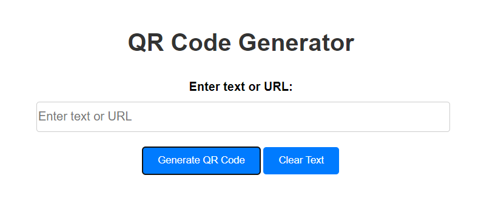

# QR Code Generator

## Description

The QR Code Generator is a simple web application that allows users to generate QR codes from text or URLs. This project is designed to demonstrate a basic implementation of a QR code generation feature using HTML, CSS, and JavaScript.

## Features

- Input a text or URL and generate a QR code.
- Clear the input field and QR code display.
- Error handling for empty input.

## Credits
This project was created by sangamprashant.